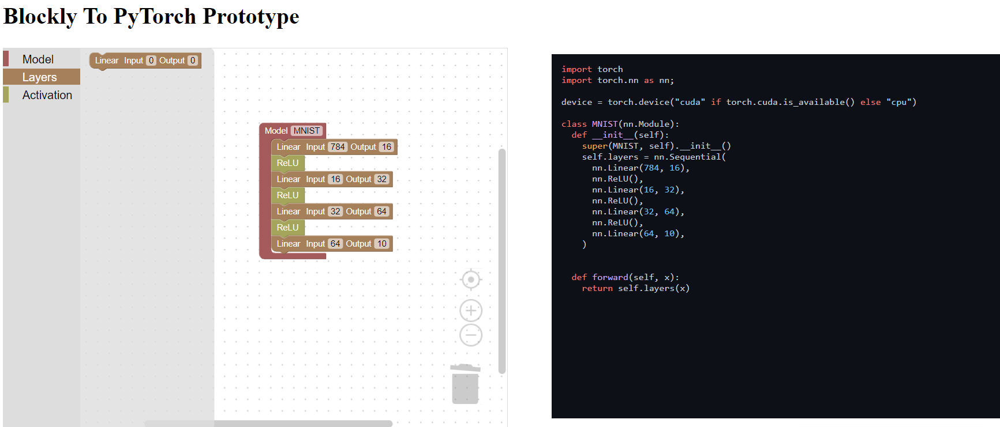

# Blockly To PyTorch

  

---

This project is a simple web application that allows you to create a neural network using the [Blockly](https://developers.google.com/blockly/) visual programming tool and then export it to a PyTorch model.

It is currently still in prototype stage and not ready for any practical use.

---

### Changelog

Version 0.0.1

- Initial prototype release

Version 0.0.2

- Add Blockly's files locally (security update)
- Move all scripts in a scripts folder and all stylesheets in a style folder

